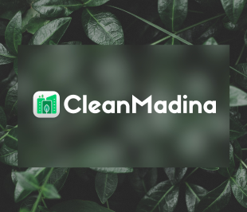

<div align="center">
  <br />
    <a>
       
    </a>
  <br />

  <div>
    
    
    
    
  </div>

# CleanMadina - Moroccan Waste Management Application


CleanMadina is a Moroccan waste management application developed using Next.js. This app aims to streamline waste collection processes and enhance community engagement in environmental sustainability. 

## 🖥️ Tech Stack

- **Next.js**: React framework for building fast, user-friendly web applications.
- **PostgreSQL**: Relational database for managing application data.
- **Drizzle ORM**: A TypeScript ORM for PostgreSQL.
- **Vercel**: Platform for frontend deployment.

## 📋 Features

- **User-Friendly Interface**: Intuitive design for easy navigation and user experience.
- **Waste Reporting**: Users can report waste issues within their community.
- **Rewards System**: Users earn rewards for participating in waste management initiatives.
- **Notifications**: Timely updates on waste collection schedules and community activities.
- **Responsive Design**: Optimized for all screen sizes.

## 🚀 Quick Start

### Prerequisites

Ensure you have the following installed on your machine:

- [Git](https://git-scm.com/)
- [Node.js](https://nodejs.org/)
- [npm](https://www.npmjs.com/)

### Installation Steps

Clone the repository:

   ```bash
   git clone https://github.com/yourusername/clean-madina.git
   cd clean-madina
   ```

2. Install dependencies:

   ```bash
   npm install
   ```

3. Set up environment variables:
   Create a `.env.local` file in the root of your project with the following content:

   ```bash
   DATABASE_URL=your_database_url
   WEB3_AUTH_CLIENT_ID=your_web3_auth_client_id
   GEMINI_API_KEY=your_gemini_api_key
   GOOGLE_MAPS_API_KEY=your_google_maps_api_key

   ```

  Replace the placeholder values with your actual credentials.
4. Run the development server:

   ```bash
   npm run dev
   ```

   Open [http://localhost:3000](http://localhost:3000) in your browser to view the app.

## 📱 Contact

If you have any issues or questions, feel free to reach out!

---

Built with ❤️ by Oclaz
